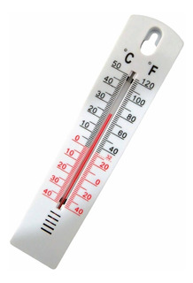

<h1 align="center">
    
</h1>

<h4 align="center"> 
	🚧 Converte Temperatura 1.0 🚀 em construção... 🚧
</h4>

<p align="center">
  

  

  	
  
  
  <a href="https://github.com/patrickdevv/conversao-temperatura/commits/master">
    
  </a>

  
   <a href="https://github.com/patrickdevv/conversao-temperatura/stargazers">
    
  </a>
</p>


## 💻 Sobre o projeto

Trata-se de uma calculadora para conversão de temperaturas Celsus para Fahrenheit e vice e versa.

## 🚀 Como executar o projeto

### Pré-requisitos

Antes de começar, você vai precisar ter instalado em sua máquina a seguinte ferramenta:
[Docker](https://www.docker.com/). 


###  Rodando a aplicação através de imagem Docker - Utilizando comando "docker container run"

```bash
# no terminal digitar o comando
$ docker container run -p 8080:8080 -d patrickdevv/conversao-temperatura

# O servidor inciará na porta:8080 - acesse http://localhost:8080 
```
